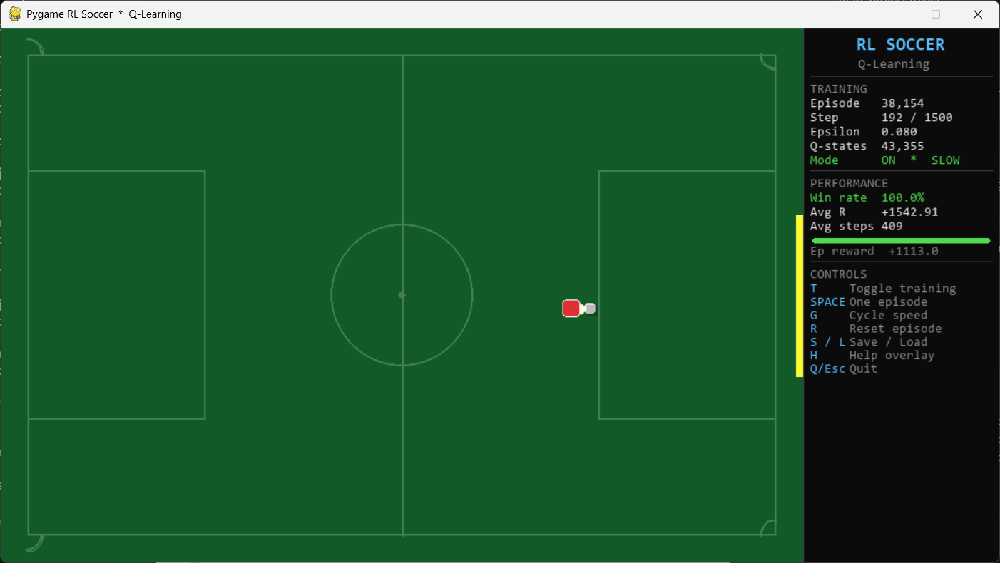
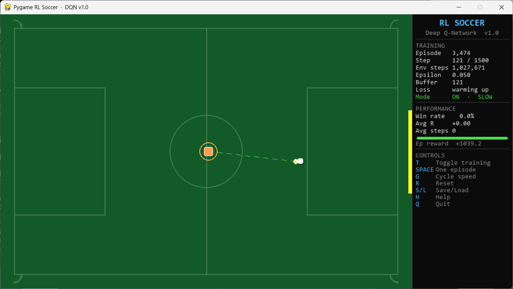

# ⚽ Pygame RL Soccer

A reinforcement learning agent that learns from scratch, through trial and error, to chase a ball and score goals. No game engines. No RL libraries. Just Python, Pygame, and math.

Two agents are included, each a step up from the last:

- 🧠 **Q-Learning** - classic tabular method, discrete state space, dictionary-based.
- 🤖 **Deep Q-Network** - neural network replaces the table, continuous state, generalises better.

Watch the agent go from random wandering to consistently finding the net.

https://github.com/user-attachments/assets/1a092f64-edcf-477d-bdee-46cf819ad2df

---

## 📸 Screenshots

### Q-Learning Agent


### Deep Q-Network Agent


---

## 🧠 How it works

The agent (red square) starts with zero knowledge of the game. Every episode it tries something, gets a reward signal, and slowly builds a policy.

**Reward signals that shape the behaviour:**

| Signal | Effect |
|--------|--------|
| 🎯 Getting closer to the ball | Small positive reward |
| 👟 Touching the ball | Bonus each step |
| ➡️ Moving the ball toward the goal | Continuous shaping |
| 📐 Positioning behind the ball before kicking | Bonus per step |
| 🥅 Scoring | Large positive reward |
| ❌ Ball out of bounds | Penalty |

Over thousands of episodes the agent learns to approach, position, align, and kick with purpose.

---

## ⚔️ Q-Learning vs Deep Q-Network

| | 🧠 Q-Learning | 🤖 Deep Q-Network |
|---|---|---|
| State representation | Discrete bins | Raw continuous floats |
| Q-function | Dictionary lookup | 3-layer neural network |
| Memory | None | Replay buffer (100k transitions) |
| Stability trick | Action inertia | Frozen target network |
| Win rate after training | ~92% | ~100% |
| Save location | `saves/q_table.pkl` | `saves/dqn_model.pt` |

Both use the same Bellman equation and epsilon-greedy exploration. The DQN simply replaces the lookup table with a neural network, letting it generalise across states it has never seen.

---

## 🚀 Setup

**1. Clone the repo**

```bash
git clone https://github.com/md-jawad-117/Pygame_RL_Soccer.git
cd Pygame_RL_Soccer
```

**2. Install dependencies**

```bash
pip install -r requirements.txt
```

> Requires **Python 3.10+**

---

## ▶️ Run

**Recommended - launch menu**

```bash
python launcher.py
```

A window opens with two cards. Click one or press `1` / `2`.

**Or run directly**

```bash
python soccer_rl.py    # Q-learning
python soccer_dqn.py   # Deep Q-Network
```

---

## 🎮 Controls

| Key | Action |
|-----|--------|
| `T` | Toggle training on / off |
| `SPACE` | Run one episode with full rendering |
| `G` | Cycle speed: SLOW -> FAST -> HYPER |
| `R` | Reset current episode |
| `S` | Save checkpoint now |
| `L` | Load checkpoint from disk |
| `H` | Toggle reward shaping overlay |
| `Q` / `Esc` | Quit and auto-save |

> **HYPER mode** skips most rendering and runs thousands of episodes per second. Switch back to SLOW to watch what the agent has learned.

---

## 📁 Project structure

```
pygame-rl-soccer/
├── launcher.py         Launch menu - pick your agent here
├── soccer_rl.py        Q-learning agent and environment
├── soccer_dqn.py       Deep Q-Network agent and environment
├── config.py           All hyperparameters in one place
├── requirements.txt
├── LICENSE
├── screenshots/        Add your screenshots here
└── saves/              Auto-created at runtime, excluded from git
```

> All hyperparameters (learning rate, discount factor, reward weights, bin counts, network size) live in `config.py`.

---

## 💾 Checkpoints

Trained models are saved to `saves/` and excluded from git. Every fresh clone starts training from zero. If a checkpoint exists when you launch, it loads automatically and training continues from where it left off.

---

## 📦 Requirements

```
pygame >= 2.1.0
numpy  >= 1.21.0
torch  >= 2.0.0
```

---
